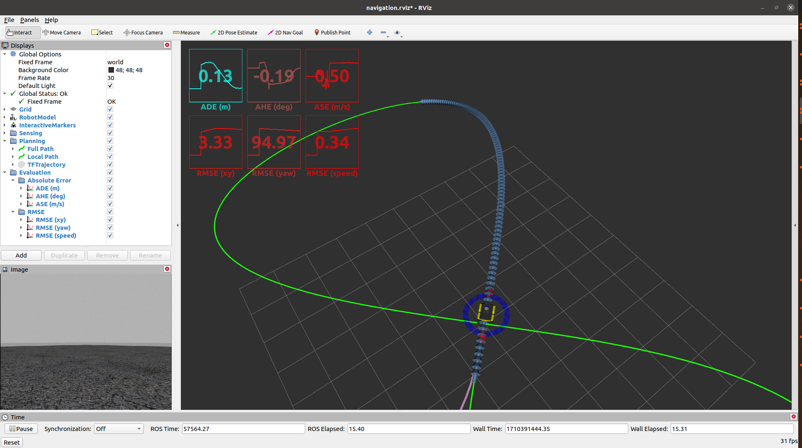

# ME5413_Planning_Project (with LQR control)

NUS ME5413 Autonomous Mobile Robotics Planning Project with PID and LQR control.


> Authors: [Ziggy](https://github.com/ziggyhuang) and [Shuo](https://github.com/SS47816)
> Co-Author: [ikun](https://github.com/ccoopq)

>Original Project: [link](https://github.com/NUS-Advanced-Robotics-Centre/ME5413_Planning_Project)


## Dependencies

- System Requirements:
  - Ubuntu 18.04
  - ROS Melodic
  - C++11 and above
  - CMake: 3.0.2 and above
- This repo depends on the following standard ROS pkgs (some are in the /src):
  - `roscpp`
  - `rospy`
  - `rviz`
  - `std_msgs`
  - `nav_msgs`
  - `geometry_msgs`
  - `visualization_msgs`
  - `tf2`
  - `tf2_ros`
  - `tf2_eigen`
  - `tf2_geometry_msgs`
  - `gazebo_ros`
  - `jsk_rviz_plugins`
  - `jackal_gazebo`
  - `jackal_navigation`
  - `velodyne_simulator`
  - `dynamic_reconfigure`

## Installation

This repo is a ros workspace, containing three rospkgs:

- `me5413_world` the main pkg containing the gazebo world, source code, and the launch files
- `jackal_description` contains the modified jackal robot model descriptions

```bash
cd
git clone https://github.com/<YOUR_GITHUB_USERNAME>/ME5413_Planning_Project.git
cd ME5413_Planning_Project

# Install all dependencies
rosdep install --from-paths src --ignore-src -r -y

# Build
catkin_make
# Source
source devel/setup.bash
```

## Usage

### 0. Gazebo World

This command will launch the gazebo with the project world

```bash
# Launch Gazebo World together with our robot
roslaunch me5413_world world.launch
```

### 1. Path Tracking

In the second terminal, launch the path publisher node and the path tracker node:

#### PID Control
```bash
roslaunch me5413_world path_tracking.launch
```

#### LQR Control
```bash
roslaunch me5413_world path_tracking_LQR.launch
```
The replaced codes are in `src/me5413_world/include/me5413_world/path_tracker_node_LQR.hpp` and `src/me5413_world/src/path_tracker_node_LQR.cpp`.




## LQR Model
(This part of the work refers to the [link](https://kowshikchilamkurthy.medium.com/rl-vs-optimal-control-lqr-for-trajectory-tracking-with-python-code-105ce44e1761))

Define system dynamics functions and cost functions.

$$x_{t+1}  =  Ax_t + Bu_t$$

$$J(u) = \frac{1}{2}\int_{t_0}^{t_f} (x^T(t)Q(t)x(t) + u^T(t)R(t)u(t)) dt$$

Q(t) is the state cost matrix. Q weighs the relative importance of each state in the state vector. Speed up convergence by locating the state where you want low error by making the corresponding value of Q larger. R(t) is the input cost matrix, and this term also becomes the regularization term. $x(t)$ can be a state vector or a state error vector.

By solving the Ricatti equation, the final governing equation is directly obtained (the t subscript is omitted for some variables).

$$K = -(R+B^TPB)^{-1}B^TPA$$

$$u(t) = Kx(t)$$

In this project, the following system dynamics function is established.

$$
x_t = x_{t-1} + v_{t-1}cos(\lambda_{t-1})dt
$$

$$
y_t = y_{t-1} + v_{t-1}sin(\lambda_{t-1})dt
$$

$$
\lambda_t = \lambda_{t-1} + \omega_{t-1}dt
$$

Where $x_t(state) = [x_t, y_t, \lambda_t]^T$, $u_t = [v_t, \omega_t]^T$.

## Evaluations
Here we choose four tests with different A and B (in meters). 

### 1. Position Error

 - The overall position estimation error of the LQR method should be smaller than that of PID and Stanley, although it may be higher in certain positions compared to the latter. The error curve of the latter fluctuates unpredictably because there has been no adjustment made to the parameters of PID, resulting in more severe overshooting. 
 - The convergence speed of the LQR algorithm is slow at the beginning, which is related to the setting of the Q matrix. It remains relatively low in the middle of the curve, corresponding to the straight-line approximation of the "8" shape curve, while it is higher on both sides, corresponding to the curved parts of the curve. This indicates that the deviation of this LQR algorithm is larger when cornering, further parameter adjustments or introduction of integral terms are needed.

### 2. RMSE
|   | RMSE(xy) | RMSE(yaw) | RMSE(speed) |
| ----- | ----- | ----- | ----- |
| LQR1 | 0.27 | 5.14 | 0.53 |
| PID1 | 0.35 | 7.87 | 0.17 |
| LQR2 | 0.44 | 9.35 | 0.50 |
| PID2 | 0.40 | 10.74 | 0.16 |
| LQR3 | 0.31 | 4.93 | 0.46 |
| PID3 | 0.38 | 8.79 | 0.22 |
| LQR4 | 0.33 | 9.04 | 0.41 |
| PID4 | 0.38 | 10.12 | 0.23 |

1 to 4 correspond to four different tests. 
- Compared to PID, LQR exhibits lower RMSE in the estimation of position (xy) and yaw, resulting in more stable tracking.
- LQR shows significant deviation in velocity estimation, possibly due to the weight setting for throttle in the R matrix of the LQR algorithm being too low, leading to inadequate constraint on the throttle value by the regularization term.


## Contribution

You are welcome contributing to this repo by opening a pull-request

We are following:

- [Google C++ Style Guide](https://google.github.io/styleguide/cppguide.html),
- [C++ Core Guidelines](https://isocpp.github.io/CppCoreGuidelines/CppCoreGuidelines#main),
- [ROS C++ Style Guide](http://wiki.ros.org/CppStyleGuide)

## License

The [ME5413_Planning_Project](https://github.com/NUS-Advanced-Robotics-Centre/ME5413_Planning_Project) is released under the [MIT License](https://github.com/NUS-Advanced-Robotics-Centre/ME5413_Planning_Project/blob/main/LICENSE)
# Planning_ME5413
